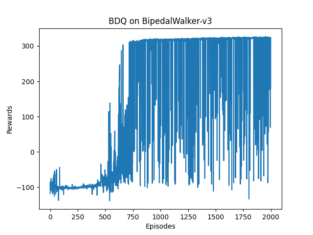

# Advanced BDQ
> Branching DQN implementation with pytorch based on https://github.com/seolhokim/BipedalWalker-BranchingDQN. 
> To weigh up the action advantages among all branches, a branch advantage is introduced.
> It seems so far to outperform the original implementation.

## Dependencies
python \=\= 3.7.0  
gym \=\= 0.18.3  
mujoco \=\= 2.2.0  
torch \=\= 1.8.1  
*Other versions may also work well. It's just a reference.*  

## Structure
**/data:** contains results of training or testing, including graphs and videos  
**/model:** contains pre-trained models

  
## Train
use:

```bash
python train.py
```

- **--round | -r :** training rounds (default: 2000)
- **--lr_rate | -l :** learning rate (default: 0.0001)
- **--batch_size | -b :** batch size (default: 64)
- **--gamma | -g :** discounting factor gamma (default: 0.99)
- **--action_scale | -a :** discrete action scale among the continuous action space (default: 25)
- **--env | -e :** environment to train in (default: BipedalWalker-v3)
- **--load | -l :** to specify the model to load in ./model/ (e.g. 25 for [env]_25.pth)  
- **--trick | -t :** use tricks to reshape rewards  
- **--save_interval | -s :** interval round to save model (default: 1000)
- **--print_interval | -d :** interval round to print evaluation (default: 200)

***It's highly recommended to use tricks in BipedalWalker, Ant and HalfCheetah.***

## Test
use:
```bash
python enjoy.py
```

- **--not_render | -n :** not to render
- **--round | -r :** evaluation rounds (default: 10)
- **--action_scale | -a :** discrete action scale, specifying network to load in ./model/ (default: 25)  
- **--env | -e :** environment to test in (default: BipedalWalker-v3)

## Performance
  